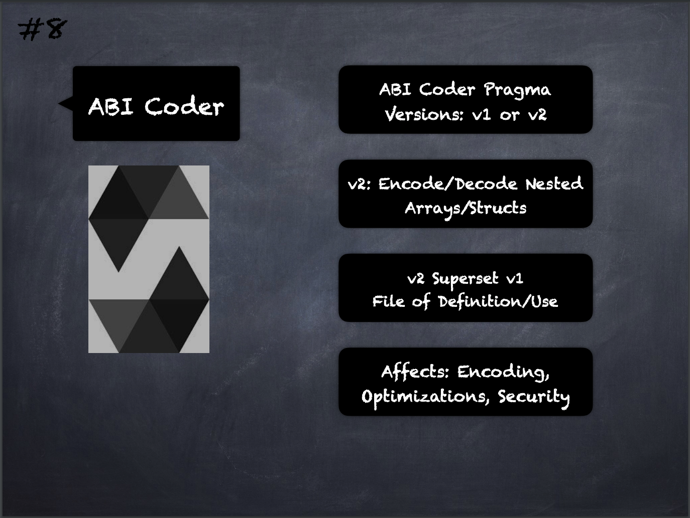

# 8 - [ABI Coder](ABI%20Coder.md)
ABI Coder Pragma: This indicates the choice between the two implementations of the ABI encoder and decoder: `pragma abicoder v1;` or `pragma abicoder v2;`

1.  The new ABI coder (v2) is able to encode and decode arbitrarily nested arrays and structs. It might produce less optimal code and has not received as much testing as the old encoder. This is activated by default.
    
2.  The set of types supported by the new encoder is a strict superset of the ones supported by the old one. Contracts that use it can interact with ones that do not without limitations. The reverse is possible only as long as the non-abicoder v2 contract does not try to make calls that would require decoding types only supported by the new encoder. The compiler can detect this and will issue an error. Simply enabling abicoder v2 for your contract is enough to make the error go away.
    
3.  This pragma applies to all the code defined in the file where it is activated, regardless of where that code ends up eventually. This means that a contract whose source file is selected to compile with ABI coder v1 can still contain code that uses the new encoder by inheriting it from another contract. This is allowed if the new types are only used internally and not in external function signatures.

___
## Slide Screenshot

___
## Slide Deck
- ABI Coder Pragma Versions: v1 or v2
- v2: Encode/Decode Nested Arrays/Structs
- v2 Superset of v1
- File of Definition/Use
- Affects: Encoding, Optimizations, Security (Implications)
___
## References
- [Youtube Reference](https://youtu.be/5eLqFac5Tkg?t=868)

___
## Resources
- 
