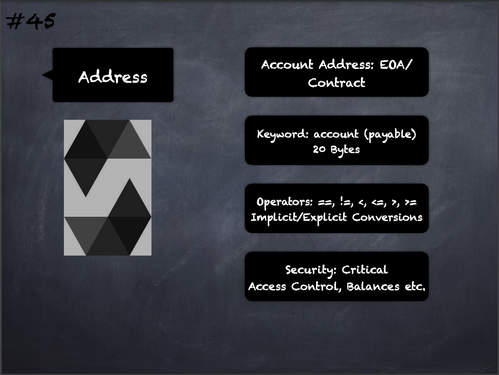

# 45 - [Address Type](Address%20Type.md)
The address type comes in two types:

1. `address`: Holds a 20 byte value (size of an Ethereum address) 
2. `address payable`: Same as `address`, but with the additional members `transfer` and `send`. `address payable` is an address you can send Ether to, while a plain `address` cannot be sent Ether. 

1.  Operators are `<=`, `<`, `==`, `!=`, `>=` and `>`
    
2.  Conversions: Implicit conversions from `address payable` to `address` are allowed, whereas conversions from `address` to `address payable` must be explicit via `payable(<address>)`. Explicit conversions to and from `address` are allowed for `uint160`, integer literals, `bytes20` and contract types. 
    
3.  Only expressions of type `address` and contract-type can be converted to the type `address payable` via the explicit conversion `payable(...)`. For contract-type, this conversion is only allowed if the contract can receive Ether, i.e., the contract either has a receive or a payable fallback function.

___
## Slide Screenshot

___
## Slide Deck
- Account Address: [EOA](EOA.md)/[Contract](Contract.md)
- Keyword: `account` (payable) 20 Bytes
- Operators are `<=`, `<`, `==`, `!=`, `>=` and `>`
- Implicit/Explicit Conversions
- Security: Critical
- Access Control, Balances etc.
___
## References
- [Youtube Reference](https://youtu.be/6VIJpze1jbU?t=631)

