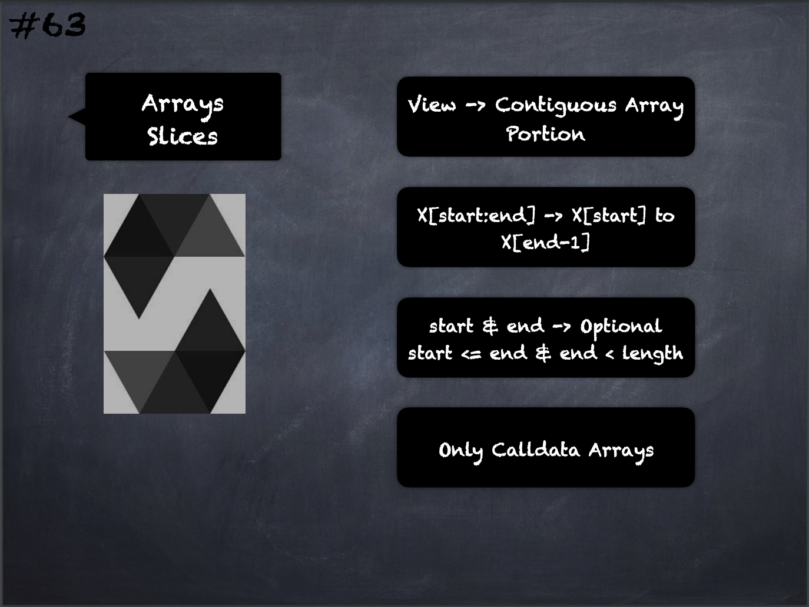

# 63 - [Arrays - Slices](Arrays%20-%20Slices.md)
[Array](Arrays.md) slices are a view on a contiguous portion of an array. 

They are written as `x[start:end]`, where start and end are expressions resulting in a `uint256` type (or implicitly convertible to it). 

The first element of the slice is `x[start]` and the last element is `x[end - 1]`

1. If start is greater than end or if end is greater than the length of the array, an exception is thrown
    
2. Both start and end are optional: start defaults to 0 and end defaults to the length of the array
    
3. Array slices do not have any members
    
4. They are implicitly convertible to arrays of their underlying type and support index access. Index access is not absolute in the underlying array, but relative to the start of the slice
    
5. Array slices do not have a type name which means no variable can have an array slices as type and they only exist in intermediate expressions
    
6. Array slices are only implemented for [calldata](../Ethereum101/Calldata.md) arrays.
    
7. Array slices are useful to [ABI-decode](ABI%20Encoding-Decoding.md) secondary data passed in function parameters

___
## Slide Screenshot

___
## Slide Deck
- View -> Contiguous Array Portion
- `x[start:end]` -> `x[start]` to `x[end-1]`
- start & end -> Optional
- `start <= end` & `end < length`
- Only [Calldata](../Ethereum101/Calldata.md) Arrays
___
## References
- [Youtube Reference](https://youtu.be/WgU7KKKomMk?t=123)

