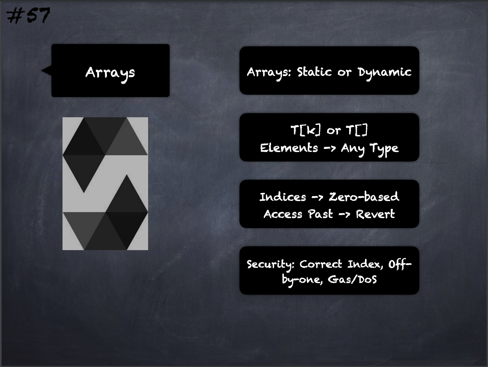

# 57 - [Arrays](Arrays.md)
Arrays can have a compile-time fixed size, or they can have a dynamic size

1.  The type of an array of fixed size k and element type T is written as `T[k]`, and an array of dynamic size as `T[]`.
   
2.  Indices are zero-based
    
3.  Array elements can be of any type, including mapping or struct. 
    
4.  Accessing an array past its end causes a failing assertion
___
## Slide Screenshot

___
## Slide Deck
- Arrays: Static or Dynamic
- `T[k`] or `T[]`
- Elements -> Any Type
- Indices -> Zero-based
- Access Past -> Revert
- Security: Correct Index, Off-by-one, Gas/DoS
___
## References
- [Youtube Reference](https://youtu.be/6VIJpze1jbU?t=1942)

___
## Resources
- 
