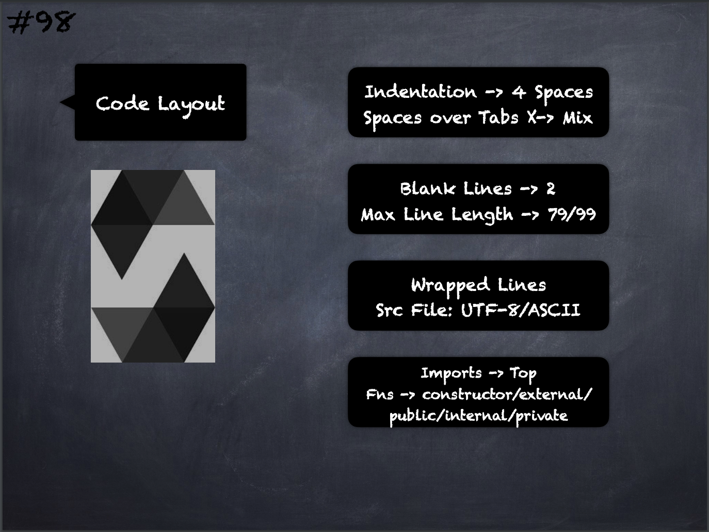

# 98 - [Code Layout](Code%20Layout.md)
1. Indentation: Use 4 spaces per indentation level
    
2. Tabs or Spaces: Spaces are the preferred indentation method. Mixing tabs and spaces should be avoided.
    
3. Blank Lines: Surround top level declarations in [Solidity](Solidity.md) source with two blank lines.
    
4. Maximum Line Length: Keeping lines to a maximum of 79 (or 99) characters helps readers easily parse the code.
    
5. Wrapped lines should conform to the following guidelines: The first argument should not be attached to the opening parenthesis. One, and only one, indent should be used. Each argument should fall on its own line. The terminating element, );, should be placed on the final line by itself.
    
6. Source File Encoding: UTF-8 or ASCII encoding is preferred.
    
7. [Imports](Imports.md): Import statements should always be placed at the top of the file.
    
8. Order of Functions: Ordering helps readers identify which functions they can call and to find the constructor and fallback definitions easier. Functions should be grouped according to their visibility and ordered: constructor, receive function (if exists), fallback function (if exists), external, public, internal, private. Within a grouping, place the view and pure functions last.

___
## Slide Screenshot

___
## Slide Deck
- Indentation -> 4 Spaces
- Spaces over Tabs X -> Mix
- Blank Lines -> 2
- Max Line Length -> 79/99
- Wrapped Lines
- Src File: UTF8/ASCII
- Imports -> Top
- Functions -> constructor/externa/public/internal/private
___
## References
- [Youtube Reference](https://youtu.be/_oN7XuyhoZA?t=1514)

