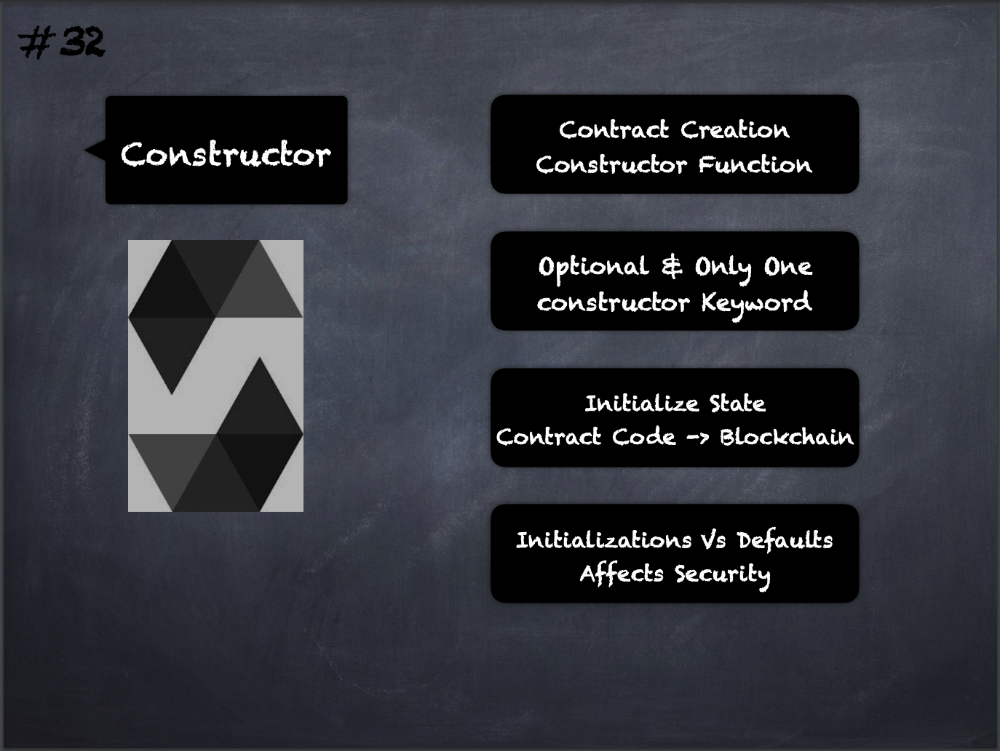

# 32 - [Constructor](Constructor.md)
Contracts can be created “from outside” via Ethereum transactions or from within [Solidity](Solidity.md) contracts. 

When a contract is created, its constructor (a function declared with the `constructor` keyword) is executed once. 

A constructor is optional and only one constructor is allowed. 

After the constructor has executed, the final code of the contract is stored on the blockchain. 

This code includes all public and external functions and all functions that are reachable from there through function calls. 

The deployed code does not include the constructor code or internal functions only called from the constructor.

___
## Slide Screenshot

___
## Slide Deck
- Contract Creation -> Constructor Function
- Optional & Only One
- `constructor` Keyword
- Initialize State
- Contract Code -> Blockchain
- Initialization vs Defaults
- Affects Security
___
## References
- [Youtube Reference](https://youtu.be/TCl1IcGl_3I?t=991)

