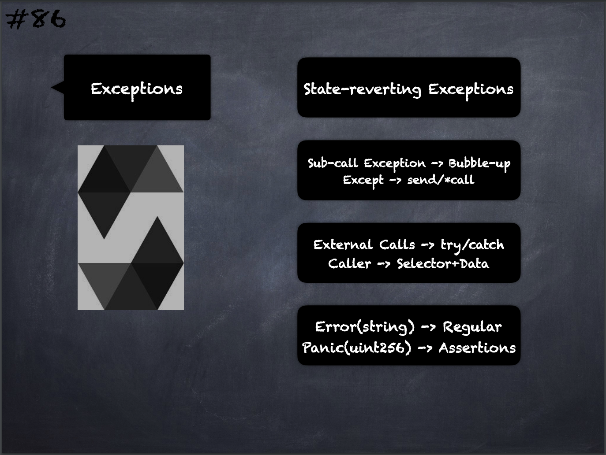

# 86 - [Exceptions](Exceptions.md)
Solidity uses state-reverting exceptions to handle errors. Such an exception undoes all changes made to the state in the current call (and all its sub-calls) and flags an error to the caller

1.  When exceptions happen in a sub-call, they “bubble up” (i.e., exceptions are rethrown) automatically. Exceptions to this rule are send and the low-level functions `call`, `delegatecall` and `staticcall`: they return false as their first return value in case of an exception instead of “bubbling up”.
    
2.  Exceptions in external calls can be caught with the `try/catch` statement
    
3.  Exceptions can contain data that is passed back to the caller. This data consists of a 4-byte selector and subsequent ABI-encoded data. The selector is computed in the same way as a function selector, i.e., the first four bytes of the keccak256-hash of a function signature - in this case an error signature.
    
4.  Solidity supports two error signatures: `Error(string)` and `Panic(uint256)`. The first (“error”) is used for “regular” error conditions while the second (“panic”) is used for errors that should not be present in bug-free code.
___
## Slide Screenshot

___
## Slide Deck
- State-reverting Exceptions
- Sub-call Exception -> Bubble-up
- Except -> `send`/`*call`
- External Calls -> `try`/`catch`
- Caller -> Selector+Data
- `Error(string)` -> Regular
- `Panic(uint256)` -> Assertions
___
## References
- [Youtube Reference](https://youtu.be/_oN7XuyhoZA?t=404)

___
## Resources
- 
