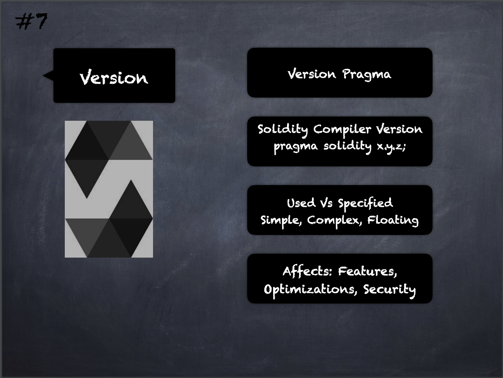

# 7 - [Pragma Version](Pragma%20Version.md)
Version [Pragma](Pragma.md): This indicates the specific [Solidity](Solidity.md) compiler version to be used for that source file and is used as follows: `pragma solidity x.y.z;` where x.y.z indicates the version of the compiler.
    
1.  Using the version pragma does not change the version of the compiler. It also does not enable or disable features of the compiler. It just instructs the compiler to check whether its version matches the one required by the pragma. If it does not match, the compiler issues an error.

2.  The latest compiler versions are in the 0.8.z range

3.  A different y in x.y.z indicates breaking changes e.g. 0.6.0 introduces breaking changes over 0.5.z. A different z in x.y.z indicates bug fixes.

4.  A `^` symbol prefixed to x.y.z in the pragma indicates that the source file may be compiled only from versions starting with x.y.z until x.(y+1).z. For e.g., `pragma solidity ^0.8.3;` indicates that source file may be compiled with compiler version starting from 0.8.3 until any 0.8.z but not 0.9.z. This is known as a “floating pragma.”

1.  Complex pragmas are also possible using `>`,`>=`,`<` and `<=` symbols to combine multiple versions e.g. `pragma solidity >=0.8.0 <0.8.3;`

___
## Slide Screenshot

___
## Slide Deck
- Version Pragma
- Solidity Compiler Version
	- `pragma solidity x.y.z`
- Used vs. Specified
- Formats: Simple, Complex, Floating
- Affects: Features, OPtimizations, Security
___
## References
- [Youtube Reference](https://youtu.be/5eLqFac5Tkg?t=610)

___
## Resources
