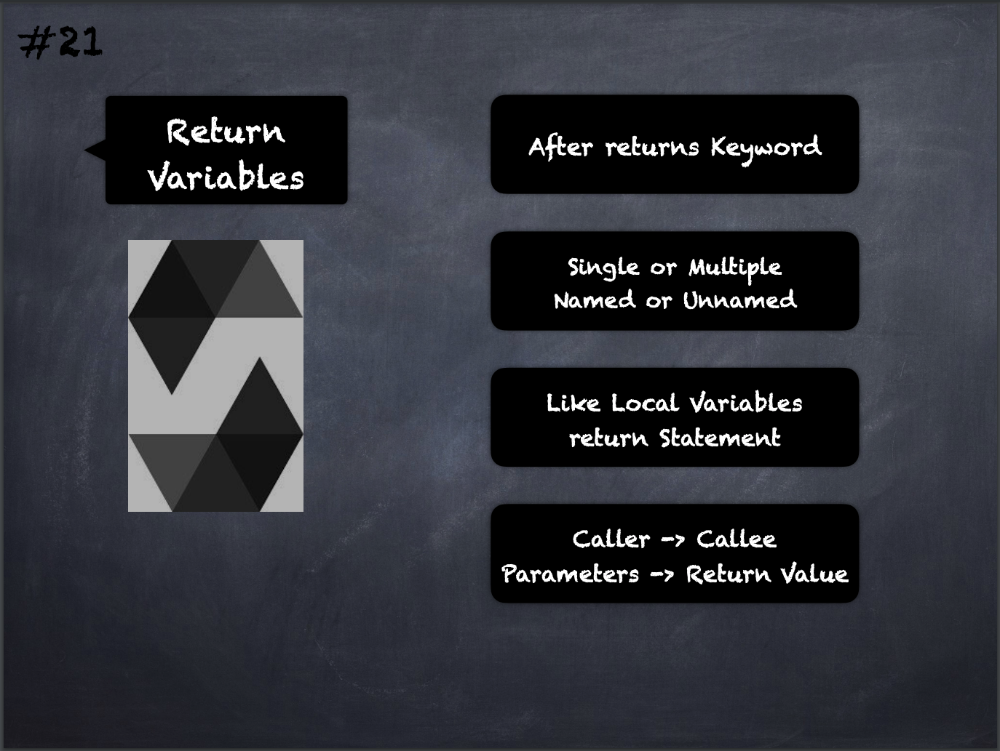

# 21 - [Return Variables](Return%20Variables.md)
[Function](Functions.md) return variables are declared with the same syntax after the `returns` keyword. 

1. The names of return variables can be omitted. Return variables can be used as any other local variable and they are initialized with their default value and have that value until they are (re-)assigned.
    
2. You can either explicitly assign to return variables and then leave the function as above, or you can provide return values (either a single or multiple ones) directly with the return statement
    
3. If you use an early return to leave a function that has return variables, you must provide return values together with the return statement
    
4. When a function has multiple return types, the statement return (v0, v1, ..., vn) can be used to return multiple values. The number of components must be the same as the number of return variables and their types have to match, potentially after an implicit conversion
___
## Slide Screenshot

___
## Slide Deck
- After `returns` Keyword
- Single or Multiple
- Named or Unnamed
- Like Local Variables
- `return` Statement
- Caller -> Callee
- Parameters -> Return Value
___
## References
- [Youtube Reference](https://www.youtube.com/watch?v=TCl1IcGl_3I)

