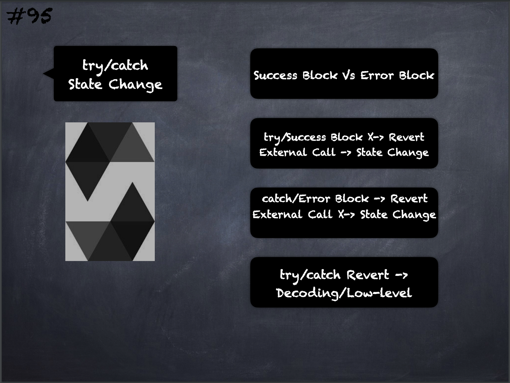

# 95 - [try/catch State Change](try-catch%20State%20Change.md)
If execution reaches a catch-block, then the state-changing effects of the external call have been reverted. 

If execution reaches the success block, the effects were not reverted. 

If the effects have been reverted, then execution either continues in a catch block or the execution of the try/catch statement itself reverts (for example due to decoding failures as noted above or due to not providing a low-level catch clause).

___
## Slide Screenshot

___
## Slide Deck
- Success Block vs. Error Block
- try/Success Block X -> Revert
- External Call -> State Change
- catch/Error Block -> Revert
- External Call X -> State Change
- [try/catch](try-catch.md)try/catch Revert -> Decoding/Low-Level
___
## References
- [Youtube Reference](https://youtu.be/_oN7XuyhoZA?t=1210)

___
## Resources
- 
