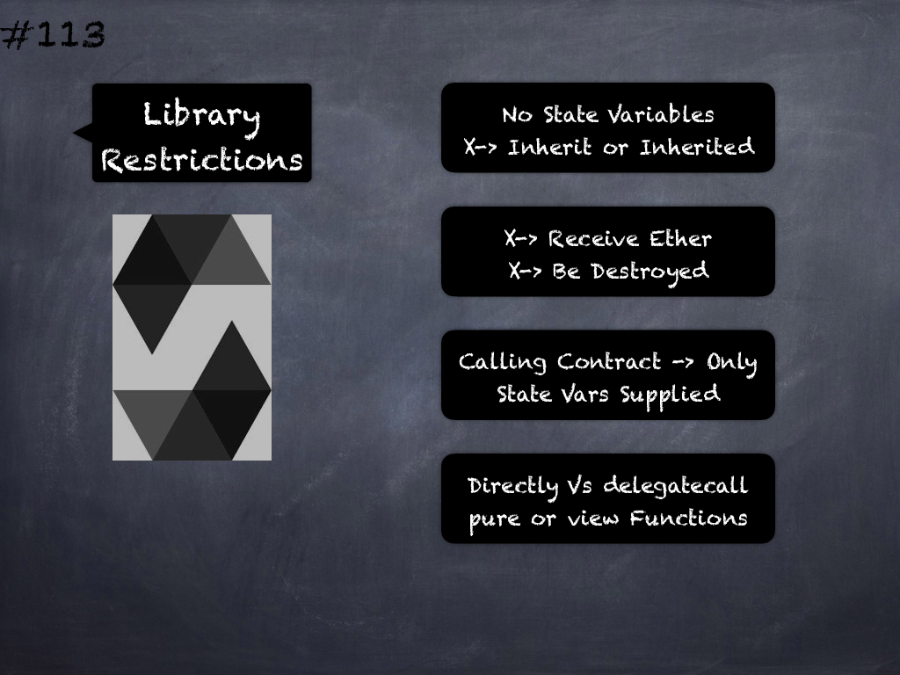

# 113 - [Library Restrictions](Library%20Restrictions.md)
In comparison to contracts, libraries are restricted in the following ways:

1.  They cannot have [state variables](State%20Variables.md)
2.  They cannot inherit nor be inherited
3.  They cannot receive Ether
4.  They cannot be destroyed
5.  It can only access state variables of the calling contract if they are explicitly supplied (it would have no way to name them, otherwise)
6.  Library functions can only be called directly (i.e. without the use of DELEGATECALL) if they do not modify the state (i.e. if they are view or pure functions), because libraries are assumed to be stateless

___
## Slide Screenshot

___
## Slide Text
- No State Variables
- X -> Inherit or Inheritied
- X -> Receive Ether
- X -> Be Destroyed
- Calling Contract -> Only State Vars Supplied
- Directly vs. delegatecall
- pure or view Functions
___
## References
- [Youtube Reference](https://youtu.be/3bFgsmsQXrE?t=924)
___
## Tags
[OZ Libraries](OZ%20Libraries.md)[selfdestruct](../Solidity101/selfdestruct.md)[Inheritance](Inheritance.md)[Storage Layout & Inheritance](Storage%20Layout%20&%20Inheritance.md)