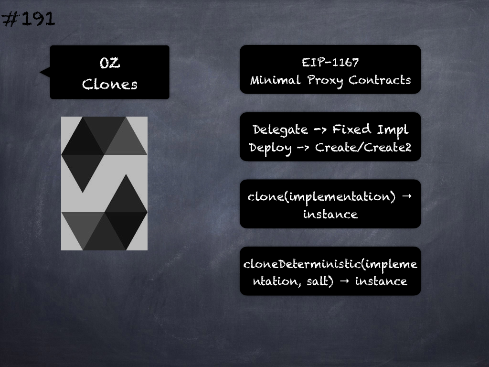

# 191 - [OZ Clones](OZ%20Clones.md)
OpenZeppelin Clones: EIP 1167 is a standard for deploying minimal proxy contracts, also known as “clones". 

To simply and cheaply clone contract functionality in an immutable way, this standard specifies a minimal bytecode implementation that delegates all calls to a known, fixed address. 

The library includes functions to deploy a proxy using either create (traditional deployment) or create2 (salted deterministic deployment). 

It also includes functions to predict the addresses of clones deployed using the deterministic method.

1.  `clone(address implementation)` → `address instance`: Deploys and returns the address of a clone that mimics the behaviour of implementation. This function uses the create opcode, which should never revert.
    
2.  `cloneDeterministic(address implementation, bytes32 salt)` → `address instance`: Deploys and returns the address of a clone that mimics the behaviour of implementation. This function uses the create2 opcode and a salt to deterministically deploy the clone. Using the same implementation and salt multiple times will revert, since the clones cannot be deployed twice at the same address.
    
3.  `predictDeterministicAddress(address implementation, bytes32 salt, address deployer)` → address predicted: Computes the address of a clone deployed using Clones.cloneDeterministic.
    
4.  `predictDeterministicAddress(address implementation, bytes32 salt)` → `address predicted`: Computes the address of a clone deployed using Clones.cloneDeterministic.
___
## Slide Screenshot

___
## Slide Deck
- EIP-1167 Minimal Proxy Contracts
- Delegate -> Fixed Impl
- Deploy -> Create/Create2
- clone(implementation) -> instance
- cloneDetereministic(implementation, salt) -> instance
___
## References
- [Youtube Reference](https://youtu.be/0kx8M4u5980?t=836)
___
## Tags