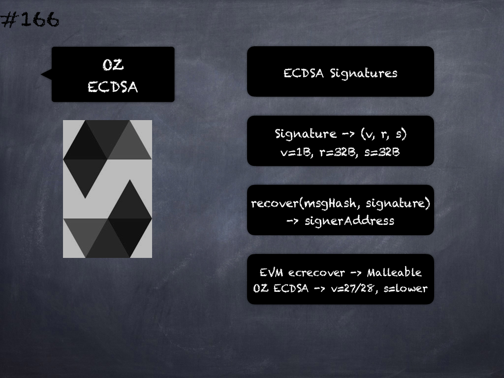

# 166 - [OZ ECDSA](OZ%20ECDSA.md)
OpenZeppelin ECDSA: provides functions for recovering and managing Ethereum account ECDSA signatures. 

These are often generated via _web3.eth.sign_, and are a 65 byte array (of type bytes in Solidity) arranged the following way: `[[v (1)], [r (32)], [s (32)]]`. 

The data signer can be recovered with _ECDSA.recover_, and its address compared to verify the signature.

Most wallets will hash the data to sign and add the prefix `'\x19Ethereum Signed Message:\n'`, so when attempting to recover the signer of an Ethereum signed message hash, you’ll want to use _toEthSignedMessageHash._

1.  The `ecrecover` EVM opcode allows for malleable (non-unique) signatures. _This library prevents that by requiring the `s` value to be in the lower half order, and the `v` value to be either 27 or 28._

___
## Slide Screenshot

___
## Slide Deck

___
## References
- Youtube Reference
___
## Tags