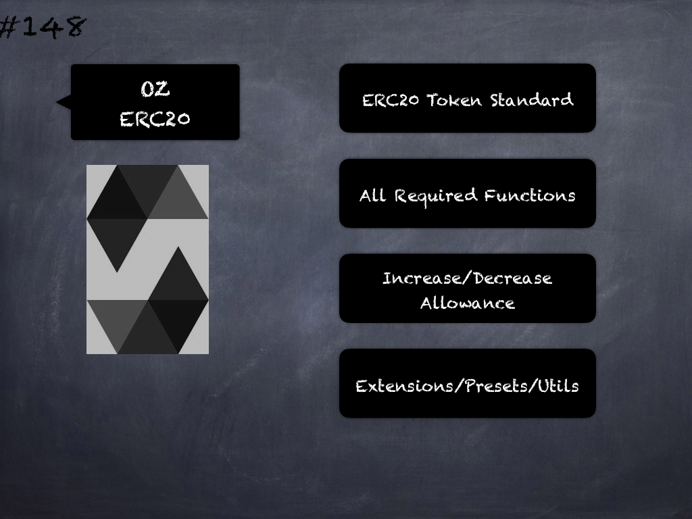

# 148 - [OZ ERC20](OZ%20ERC20.md)
OpenZeppelin ERC20: Implements the popular ERC20 token standard. The functions are:

1.  _constructor(string name_, string symbol_)_: Sets the values for name and symbol. The default value of decimals is 18. To select a different value for decimals you should overload it. All three of these values are immutable: they can only be set once during construction.
    
2.  _name()_ → _string_: Returns the name of the token.
    
3.  _symbol()_ → _string_: Returns the symbol of the token, usually a shorter version of the name.
    
4.  _decimals()_ → _uint8_: Returns the number of decimals used to get its user representation. For example, if decimals equals 2, a balance of 505 tokens should be displayed to a user as 5.05 (505 / 10 ** 2). Tokens usually opt for a value of 18, imitating the relationship between Ether and Wei. This is the value ERC20 uses, unless this function is overridden.
    
5.  _totalSupply()_: Returns the amount of tokens in existence.
    
6.  _balanceOf(address account)_ → _uint256_: Returns the amount of tokens owned by account
    
7.  _transfer(address recipient, uint256 amount)_ → _bool_: Moves amount tokens from the caller’s account to recipient. Returns a boolean value indicating whether the operation succeeded. Emits a Transfer event.
    
8.  _allowance(address owner, address spender)_ → _uint256_: Returns the remaining number of tokens that spender will be allowed to spend on behalf of owner through transferFrom. This is zero by default. This value changes when approve or transferFrom are called.
    
9.  _approve(address spender, uint256 amount)_ → _bool_: Sets amount as the allowance of spender over the caller’s tokens. Returns a boolean value indicating whether the operation succeeded. Emits an Approval event. Warning: changing an allowance with this method brings the risk that someone may use both the old and the new allowance by unfortunate transaction ordering. One possible solution to mitigate this race condition is to first reduce the spender’s allowance to 0 and set the desired value afterwards: https://github.com/ethereum/EIPs/issues/20#issuecomment-263524729
    
10.  _transferFrom(address sender, address recipient, uint256 amount)_ → _bool_: Moves amount tokens from sender to recipient using the allowance mechanism. amount is then deducted from the caller’s allowance. Returns a boolean value indicating whether the operation succeeded. Emits a Transfer event.
    
11.  _increaseAllowance(address spender, uint256 addedValue)_ → _bool_ (Non-standard): Atomically increases the allowance granted to spender by the caller. This is an alternative to approve that can be used as a mitigation for the warning above. Emits an Approval event indicating the updated allowance. Requirement is that spender cannot be the zero address.
    
12.  _decreaseAllowance(address spender, uint256 subtractedValue)_ → _bool_ (Non-standard): Atomically decreases the allowance granted to spender by the caller. This is an alternative to approve that can be used as a mitigation for the warning described above. Emits an Approval event indicating the updated allowance. Requirements are: 1) spender cannot be the zero address. 2) spender must have allowance for the caller of at least subtractedValue.
The different extensions/presets are:

1.  OpenZeppelin ERC20Burnable: Extension of ERC20 that allows token holders to destroy both their own tokens and those that they have an allowance for, in a way that can be recognized off-chain (via event analysis).
    
2.  OpenZeppelin ERC20Capped: Extension of ERC20 that adds a cap to the supply of tokens and enforces it in the mint function.
    
3.  OpenZeppelin ERC20Pausable: ERC20 token with pausable token transfers, minting and burning. Useful for scenarios such as preventing trades until the end of an evaluation period, or having an emergency switch for freezing all token transfers in the event of a large bug. The __beforeTokenTransfer()_ internal function enforces the not paused condition. 
    
4.  OpenZeppelin ERC20Snapshot: This contract extends an ERC20 token with a snapshot mechanism. When a snapshot is created, the balances and total supply at the time are recorded for later access. This can be used to safely create mechanisms based on token balances such as trustless dividends or weighted voting. Snapshots are created by the internal __snapshot_ function, which will emit the Snapshot event and return a snapshot id. To get the total supply at the time of a snapshot, call the function _totalSupplyAt_ with the snapshot id. To get the balance of an account at the time of a snapshot, call the _balanceOfAt_ function with the snapshot id and the account address.
    
5.  OpenZeppelin ERC20PresetFixedSupply: ERC20 token, including: 1) Preminted initial supply 2) Ability for holders to burn (destroy) their tokens 3) No access control mechanism (for minting/pausing) and hence no governance. This contract uses _ERC20Burnable_ contract to include burn capabilities
    
6.  OpenZeppelin ERC20PresetMinterPauser: ERC20 token, including: 1) ability for holders to burn (destroy) their tokens 2) a minter role that allows for token minting (creation) 3) a pauser role that allows to stop all token transfers. This contract uses _AccessControl_ contract to lock permissioned functions using the different roles. The account that deploys the contract will be granted the minter and pauser roles, as well as the default admin role, which will let it grant both minter and pauser roles to other accounts.
___
## Slide Screenshot

___
## Slide Deck
- ERC20 Token Standard
- All Required Functions
- Increase/Decrease Allowance
- Extensions/Presets/Utils
___
## References
- [Youtube Reference](https://youtu.be/C0zBhTgppLQ?t=1024)
___
## Tags