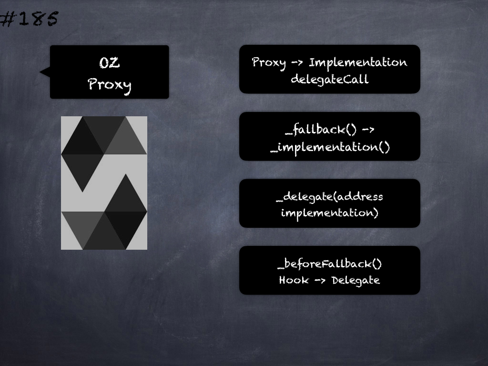

# 185 - [OZ Proxy](OZ%20Proxy.md)
OpenZeppelin Proxy: This abstract contract provides a fallback function that delegates all calls to another contract using the EVM instruction delegatecall. 

We refer to the second contract as the implementation behind the proxy, and it has to be specified by overriding the virtual _implementation function. 

Additionally, delegation to the implementation can be triggered manually through the _fallback function, or to a different contract through the _delegate function. 

The success and return data of the delegated call will be returned back to the caller of the proxy.

1.  __delegate(address implementation)_: Delegates the current call to implementation. This function does not return to its internal call site, it will return directly to the external caller.
    
2.  __implementation()_ → _address_: This is a virtual function that should be overridden so it returns the address to which the fallback function and __fallback_ should delegate.
    
3.  __fallback()_: Delegates the current call to the address returned by __implementation()_. This function does not return to its internal call site, it will return directly to the external caller.
    
4.  _fallback()_: Fallback function that delegates calls to the address returned by __implementation()_. Will run if no other function in the contract matches the call data.
    
5.  _receive()_: Fallback function that delegates calls to the address returned by __implementation()_. Will run if call data is empty.
    
6.  __beforeFallback()_: Hook that is called before falling back to the implementation. Can happen as part of a manual _fallback call, or as part of the Solidity fallback or receive functions. If overridden, should call _super._beforeFallback()_.
___
## Slide Screenshot

___
## Slide Deck

___
## References
- Youtube Reference
___
## Tags