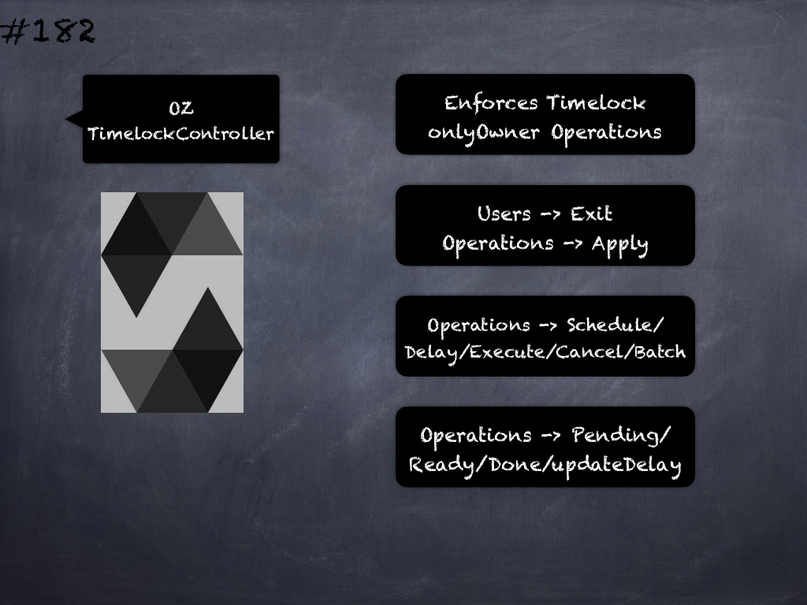

# 182 - [OZ TimelockController](OZ%20TimelockController.md)
OpenZeppelin TimelockController: acts as a timelocked controller. 

When set as the owner of an Ownable smart contract, it enforces a timelock on all `onlyOwner` maintenance operations. 

This gives time for users of the controlled contract to exit before a potentially dangerous maintenance operation is applied. 

By default, this contract is self administered, meaning administration tasks have to go through the timelock process. 

The proposer (resp executor) role is in charge of proposing (resp executing) operations. 

A common use case is to position this TimelockController as the owner of a smart contract, with a multisig or a DAO as the sole proposer.

1.  `constructor(uint256 minDelay, address[] proposers, address[] executors)`: Initializes the contract with a given minDelay.
    
2.  `receive()`: Contract might receive/hold ETH as part of the maintenance process.
    
3.  `isOperation(bytes32 id)` → `bool pending`: Returns whether an id corresponds to a registered operation. This includes both Pending, Ready and Done operations.
    
4.  `isOperationPending(bytes32 id)` → `bool pending`: Returns whether an operation is pending or not.
    
5.  `isOperationReady(bytes32 id)` → `bool ready`: Returns whether an operation is ready or not.
    
6.  `isOperationDone(bytes32 id)` → `bool done`: Returns whether an operation is done or not.
    
7.  `getTimestamp(bytes32 id)` → `uint256 timestamp`: Returns the timestamp at which an operation becomes ready (0 for unset operations, 1 for done operations).
    
8.  `getMinDelay()` → `uint256 duration`: Returns the minimum delay for an operation to become valid. This value can be changed by executing an operation that calls updateDelay.
    
9.  `hashOperation(address target, uint256 value, bytes data, bytes32 predecessor, bytes32 salt)` → `bytes32 hash`: Returns the identifier of an operation containing a single transaction.
    
10.  `hashOperationBatch(address[] targets, uint256[] values, bytes[] datas, bytes32 predecessor, bytes32 salt)` → `bytes32 hash`: Returns the identifier of an operation containing a batch of transactions.
    
11.  `schedule(address target, uint256 value, bytes data, bytes32 predecessor, bytes32 salt, uint256 delay)`: Schedule an operation containing a single transaction. Emits a CallScheduled event. Requirements: the caller must have the 'proposer' role.
    
12.  `scheduleBatch(address[] targets, uint256[] values, bytes[] datas, bytes32 predecessor, bytes32 salt, uint256 delay)`: Schedule an operation containing a batch of transactions. Emits one CallScheduled event per transaction in the batch. Requirements: the caller must have the 'proposer' role.
    
13.  `cancel(bytes32 id)`: Cancel an operation. Requirements: the caller must have the 'proposer' role.
    
14.  `execute(address target, uint256 value, bytes data, bytes32 predecessor, bytes32 salt)`: Execute an (ready) operation containing a single transaction. Emits a CallExecuted event. Requirements: the caller must have the 'executor' role.
    
15.  `executeBatch(address[] targets, uint256[] values, bytes[] datas, bytes32 predecessor, bytes32 salt)`: Execute an (ready) operation containing a batch of transactions. Emits one CallExecuted event per transaction in the batch. Requirements: the caller must have the 'executor' role.
    
16.  `updateDelay(uint256 newDelay)`: Changes the minimum timelock duration for future operations. Emits a MinDelayChange event. Requirements: the caller must be the timelock itself. This can only be achieved by scheduling and later executing an operation where the timelock is the target and the data is the ABI-encoded call to this function.

___
## Slide Screenshot

___
## Slide Deck
- Enforces Timelock
- onlyOwner Operations
- Users -> Exit
- Operations -> Apply
- Operations -> Schedule/Delay/Execute/Cancel/Batch
- Operations -> Pending/Ready/Done/updateDelay
___
## References
- [Youtube Reference](https://youtu.be/0kx8M4u5980?t=57)
___
## Tags