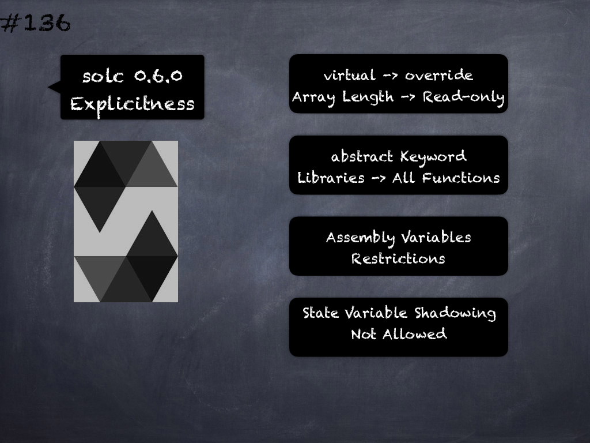

# 136 - [solc 0.6.0 Explicitness](solc%200.6.0%20Explicitness.md)
Solidity v0.6.0 Explicitness Requirements:

1.  Functions can now only be overridden when they are either marked with the virtual keyword or defined in an interface. Functions without implementation outside an interface have to be marked virtual. When overriding a function or modifier, the new keyword override must be used. When overriding a function or modifier defined in multiple parallel bases, all bases must be listed in parentheses after the keyword like so: override(Base1, Base2).
    
2.  Member-access to length of arrays is now always read-only, even for storage arrays. It is no longer possible to resize storage arrays by assigning a new value to their length. Use `push()`, `push(value)` or `pop()` instead, or assign a full array, which will of course overwrite the existing content. The reason behind this is to prevent storage collisions of gigantic storage arrays.
    
3.  The new keyword abstract can be used to mark contracts as abstract. It has to be used if a contract does not implement all its functions. Abstract contracts cannot be created using the new operator, and it is not possible to generate bytecode for them during compilation.
    
4.  Libraries have to implement all their functions, not only the internal ones.
    
5.  The names of variables declared in inline assembly may no longer end in `slot` or `offset`.
    
6.  Variable declarations in inline assembly may no longer shadow any declaration outside the inline assembly block. If the name contains a dot, its prefix up to the dot may not conflict with any declaration outside the inline assembly block.
    
7.  State variable shadowing is now disallowed. A derived contract can only declare a state variable x, if there is no visible state variable with the same name in any of its bases.

___
## Slide Screenshot

___
## Slide Deck
- virtual -> override
- Array Length -> Read-only
- `abstract` Keyword
- Libraries -> Implement All Functions
- Assembly Variables Restrictions
- State Variable Shadowing Not Allowed
___
## References
- [Youtube Reference](https://youtu.be/TqMIbouwePE?t=1574)
___
## Tags