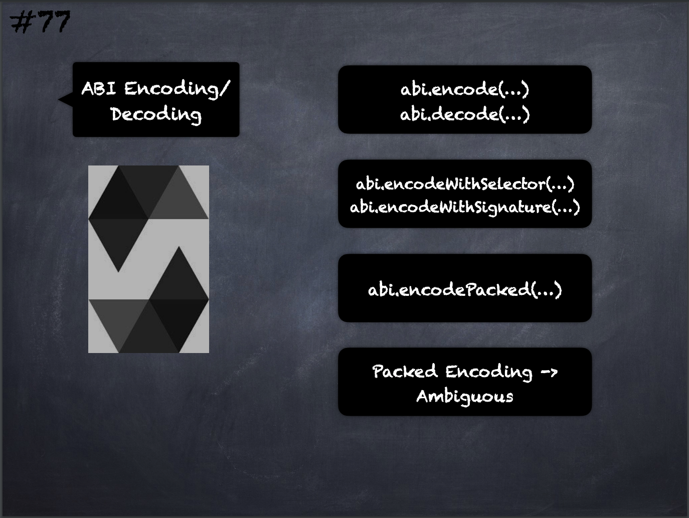

# 77 - [ABI Encoding-Decoding](ABI%20Encoding-Decoding.md)
[ABI](../1.%20Ethereum101/ABI.md) Encoding and Decoding Functions:

1. `abi.decode(bytes memory encodedData, (...)) returns (...)`: ABI-decodes the given data, while the types are given in parentheses as second argument.
    
2. `abi.encode(...)` returns (bytes memory): ABI-encodes the given arguments
    
3. `abi.encodePacked(...)` returns (bytes memory): Performs packed encoding of the given arguments. Note that packed encoding can be ambiguous!
    
4. `abi.encodeWithSelector(bytes4 selector, ...) returns (bytes memory)`: ABI-encodes the given arguments starting from the second and prepends the given four-byte selector
    
5. `abi.encodeWithSignature(string memory signature, ...) returns (bytes memory)`: Equivalent to abi.encodeWithSelector(bytes4(keccak256(bytes(signature))), …)

___
## Slide Screenshot

___
## Slide Deck
- `abi.encode(...)`
- `abi.decode(...)`
- `abi.encodeWithSelector(...)`
- `abi.decodeWithSignature(...)`
- `abi.encodePacked(...)`
- Packed Encoding -> Ambiguous
___
## References
- [Youtube Reference](https://youtu.be/WgU7KKKomMk?t=1377)

___
## Code Examples
```
addr.call(abi.encodeWithSignature("transfer(address,uint256)", 0xSomeAddress, 123))
```

```
bytes4 selector = bytes4(keccak256("someFunc(address,uint256)"));
abi.encodeWithSelector(selector, _param1, _param2)
```


