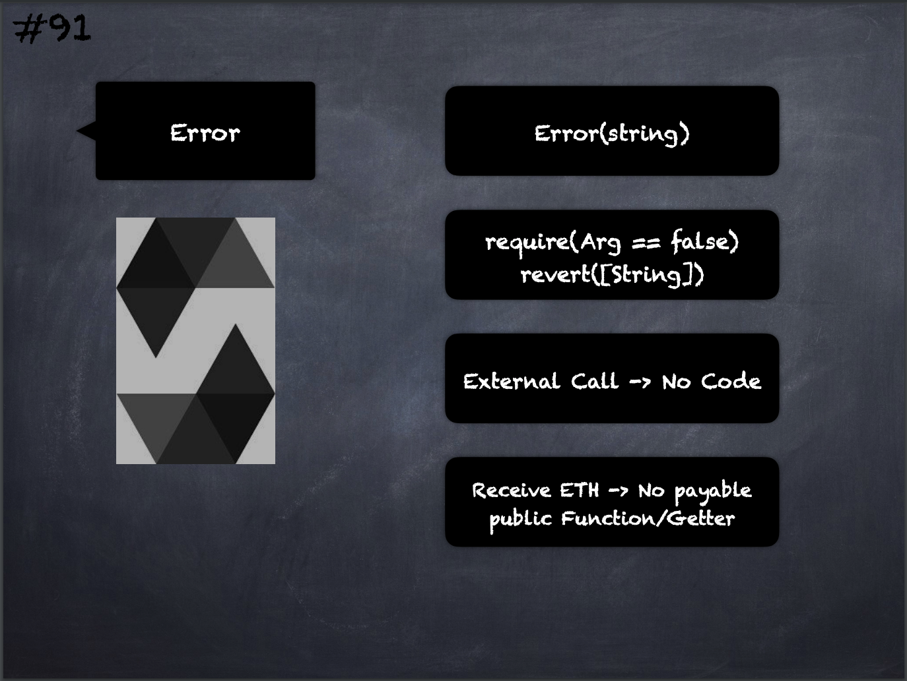

# 91 - [Errors](Errors.md)
A `Error(string)` exception (or an exception without [data](../1.%20Ethereum101/Data.md)) is generated in the following situations:

1. Calling `require` with an argument that evaluates to false.
    
2. If you perform an external function call targeting a contract that contains no code
    
3. If your contract receives Ether via a public function without payable modifier (including the [Constructor](Constructor.md) and the [Fallback function](Fallback%20Function.md))
    
4. If your contract receives Ether via a public getter function

___
## Slide Screenshot

___
## Slide Deck
- `Error(string)`
- `require(Arg == false)`
- `revert([String])`
- Receive ETH -> No payable public Function/Getter
___
## References
- [Youtube Reference](https://youtu.be/_oN7XuyhoZA?t=924)
- [Solidity by Example - Error](https://solidity-by-example.org/error/)
## Solidity by Example
```
// SPDX-License-Identifier: MIT
pragma solidity ^0.8.3;

contract Error {
    function testRequire(uint _i) public pure {
        // Require should be used to validate conditions such as:
        // - inputs
        // - conditions before execution
        // - return values from calls to other functions
        require(_i > 10, "Input must be greater than 10");
    }

    function testRevert(uint _i) public pure {
        // Revert is useful when the condition to check is complex.
        // This code does the exact same thing as the example above
        if (_i <= 10) {
            revert("Input must be greater than 10");
        }
    }

    uint public num;

    function testAssert() public view {
        // Assert should only be used to test for internal errors,
        // and to check invariants.

        // Here we assert that num is always equal to 0
        // since it is impossible to update the value of num
        assert(num == 0);
    }

    // custom error
    error InsufficientBalance(uint balance, uint withdrawAmount);

    function testCustomError(uint _withdrawAmount) public view {
        uint bal = address(this).balance;
        if (bal < _withdrawAmount) {
            revert InsufficientBalance({balance: bal, withdrawAmount: _withdrawAmount});
        }
    }
}
```

