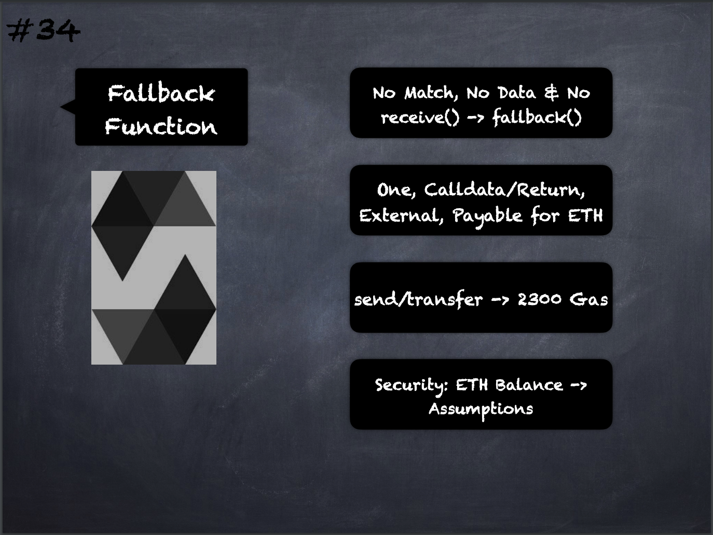

# 34 - [Fallback Function](Fallback%20Function.md)
A contract can have at most one fallback function, declared using either `fallback () external [payable]` or `fallback (bytes calldata _input) external [payable] returns (bytes memory _output)`, both without the function keyword. This [Function](Functions.md) must have external visibility.

1. The fallback function is executed on a call to the contract if none of the other functions match the given [function signature](../1.%20Ethereum101/Function%20Selector.md), or if no data was supplied at all and there is no receive Ether function. The fallback function always receives data, but in order to also receive Ether it must be marked payable.
    
2. In the worst case, if a payable fallback function is also used in place of a [receive function](Receive%20Function.md), it can only rely on 2300 gas being available

___
## Slide Screenshot

___
## Slide Deck
- No Match, No Data & No `receive()` -> `fallback()`
- One, Calldata/Return, External, Payalbe for ETH
- send/transfer -> 2300 Gas
- Security: ETH Balance -> Assumptions
___
## References
- [Youtube Reference](https://youtu.be/TCl1IcGl_3I?t=1276)

