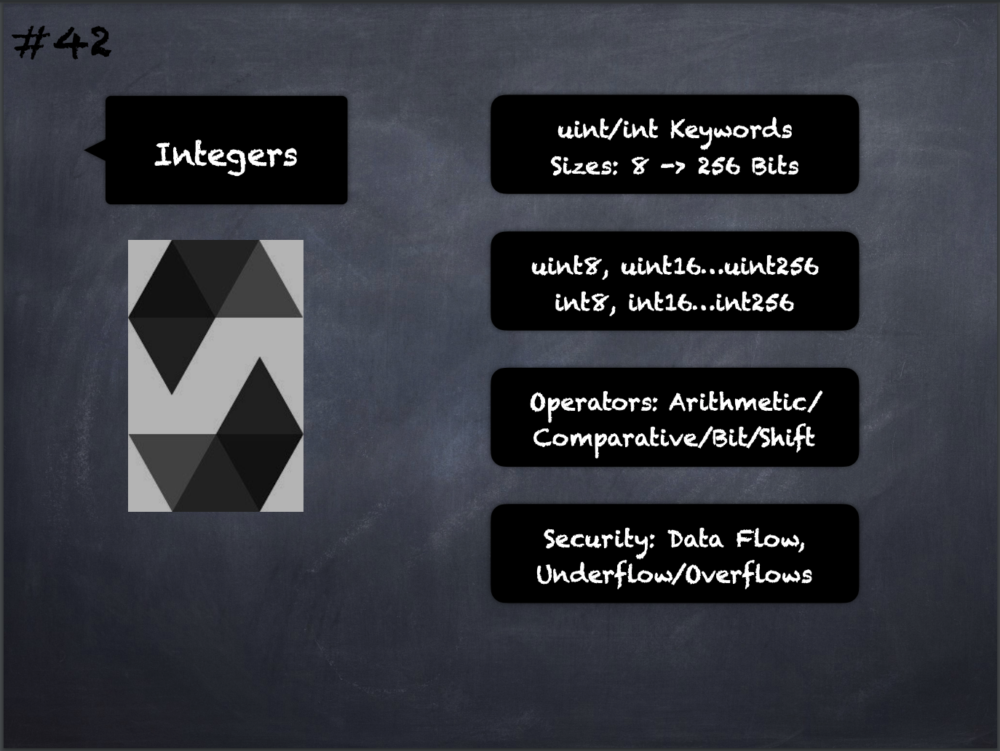

# 42 - [Integers](Integers.md)
`int` / `uint`: Signed and unsigned integers of various sizes. Keywords `uint8` to `uint256` in steps of 8 (unsigned of 8 up to 256 bits) and `int8` to `int256`. `uint` and `int` are aliases for `uint256` and `int256`, respectively. 

Operators are:     
1. Comparisons: `<=`, `<`, `==`, `!=`, `>=`, `>` (evaluate to `bool`)

2. Bit operators: `&`, `|`, `^` (bitwise exclusive or), `~` (bitwise negation)

3. Shift operators: 
	- `<<` (left shift)
	- `>>` (right shift)

4. Arithmetic operators: `+`, `-`, unary `-` (only for signed integers), `*`, `/`, `%` (modulo), `**` (exponentiation)

___
## Slide Screenshot

___
## Slide Deck
- `uint`/`int` Keywords
- Sizes: 8 -> 256 bits
- `uint8`, `uint16...uint256`
- `int8`, `int16..int256`
- Operators: Arithemtic/Comparative/Bit/Shift
- Security: Data Flow, Underflow/Overflow
___
## References
- [Youtube Reference](https://youtu.be/6VIJpze1jbU?t=190)
___
## Tags
[Comparison & Bitwise Logic](../1.%20Ethereum101/Comparison%20&%20Bitwise%20Logic.md)

